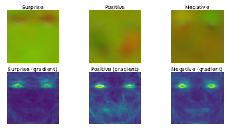
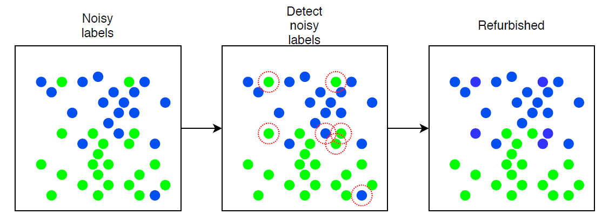

# Noisy_MER
This repository contains the code for the paper 
```
Micro-expression recognition with noisy labels, Tuomas Varanka, Wei Peng, Guoying Zhao, IS&T Electronic
Imaging: Human Vision and Electronic Imaging 2021 (157-1-157-8)
```
link: https://doi.org/10.2352/ISSN.2470-1173.2021.11.HVEI-157

## Running the code
1. Setting up the datasets. Go to the datasets.py file and set the paths to the directories of the datasets and provide the excel file path containing the meta data.
2. pip install -r requirements.txt
3. Run the main.py file, from which you can further select parameters.





